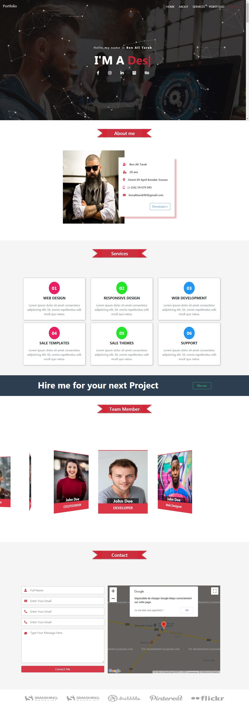

# Portfolio




Full Responsive Portfolio  :


[Bootstrap 4](https://getbootstrap.com/)

[SCSS](https://sass-lang.com/) 

[Gulpjs 4](https://gulpjs.com/)

[Owl carousel 2](https://owlcarousel2.github.io/OwlCarousel2/) 

[Swiperjs](https://idangero.us/swiper/) 

[Typedjs](https://mattboldt.com/typed.js/) 

[Particlesjs](https://vincentgarreau.com/particles.js/) 

[jquery](https://jquery.com/) 

[Babel](https://babeljs.io/) 

[Gmapsjs](https://hpneo.dev/gmaps/)  

## Installation
to install packages: 

```bash
** yarn install
```


## Run Project

```python
** yarn start
```


## Contact
[LinkedIn](https://www.linkedin.com/in/tarekbenali90/)

## Codepen
[Codepen](https://codepen.io/Tarek-BenAli/)

## NPM Project
[NPM](https://www.npmjs.com/~tarek.benali)

